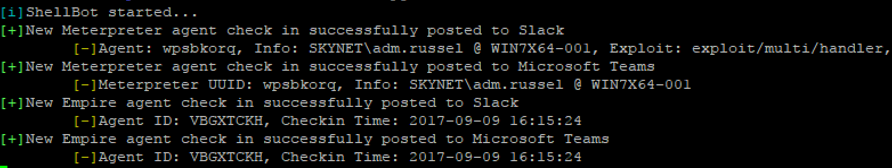
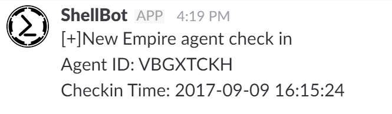
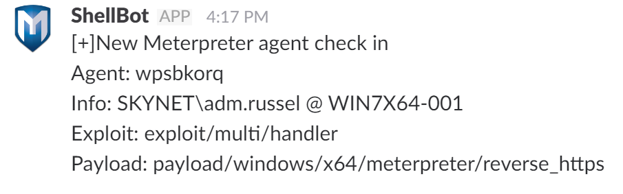
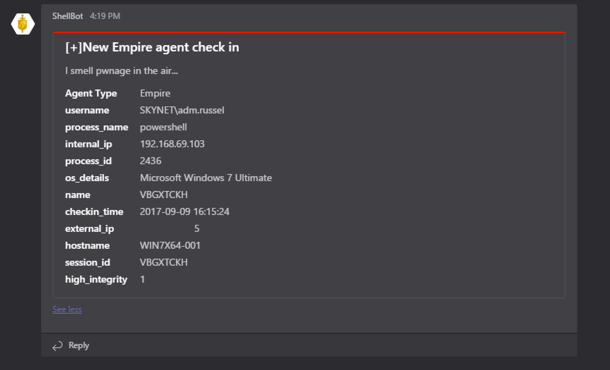
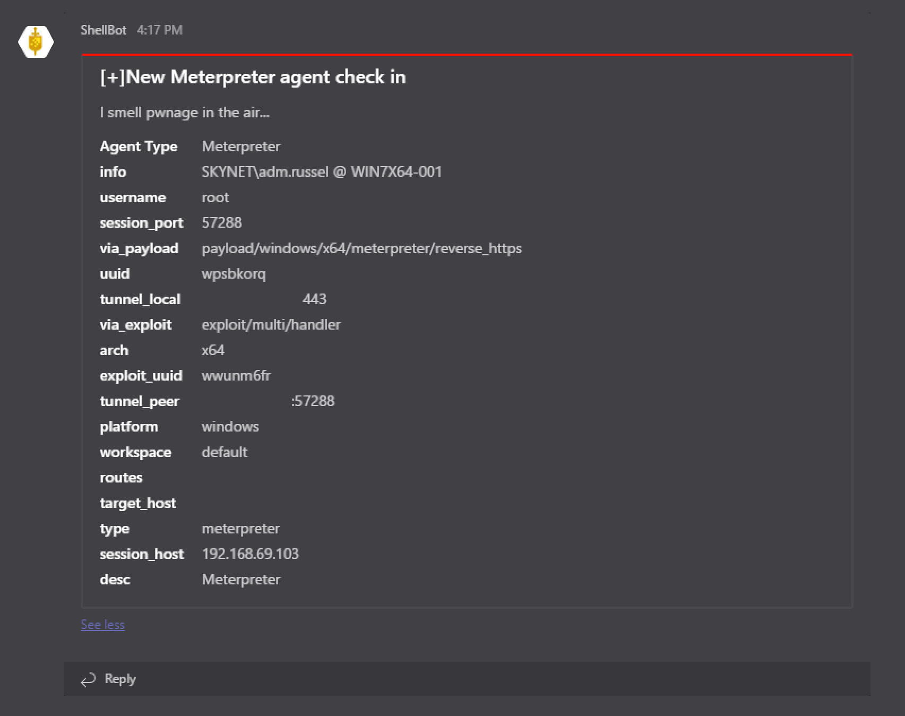

# ShellBot
ShellBot is a bot that will post a notification to Slack and/or Microsoft Teams whenever a new Empire or Meterpreter agent connection is received.
A blog post on the bot can be found here: https://www.swordshield.com/2016/11/slackshellbot



### Install
sudo pip -r requirements.txt
OR
sudo apt-get update && sudo apt-get install python-requests python-msgpack -y

### ShellBot Usage
```
usage: shellbot.py [-h] [--debug] [-v]

optional arguments:
  -h, --help  show this help message and exit
  --debug     Enable debug output to console
  -v          Enable verbose output to console
```

### ShellBot Configuration File
ShellBot uses a configuration file, shellbot.conf, that must be located in the same directory as shellbot.py.
The Metasploit RPC interface must be available to check for Meterpreter Agents.
The Empire database must be available to check for Empire Agents.

Example configuration:
```
[slack]
slackHook = https://hooks.slack.com/services/<randomstuff>
botName = ShellBot
channel = #shellbot
[teams]
teamsHook = https://outlook.office.com/webhook/<randomstuff>
[ShellBot]
sleepTime = 60
[empire]
db = /opt/Empire/data/empire.db
[msf]
msfRpcHost = 127.0.0.1
msfRpcPort = 55552
msfRpcUser = msf
msfRpcPass = SuperSecret
[teams]
teamsHook = https://outlook.office.com/webhook/<randomstuff>
```

### MSFRPC
https://help.rapid7.com/metasploit/Content/api-rpc/getting-started-api.html

You'll likely want to issue `load msgrpc`
```
msf > load msgrpc
[*] MSGRPC Service:  127.0.0.1:55552
[*] MSGRPC Username: msf
[*] MSGRPC Password: JZXiLwT4
[*] Successfully loaded plugin: msgrpc
```

You can use the msfrpc dameon `msfrpcd -P BxunCyDD -U msf -a 127.0.0.1 -S -p 55552`
```
Usage: msfrpcd <options>

OPTIONS:

    -P <opt>  Specify the password to access msfrpcd
    -S        Disable SSL on the RPC socket
    -U <opt>  Specify the username to access msfrpcd
    -a <opt>  Bind to this IP address
    -f        Run the daemon in the foreground
    -h        Help banner
    -n        Disable database
    -p <opt>  Bind to this port instead of 55553
    -t <opt>  Token Timeout (default 300 seconds
    -u <opt>  URI for Web server
```

## Screenshots
### Slack
Empire Agent Checkin on Slack



Meterpreter Agent Checkin on Slack



### Microsoft Teams
Empire Agent Checkin on Microsoft Teams



Meterpreter Agent Checkin on Microsoft Teams

